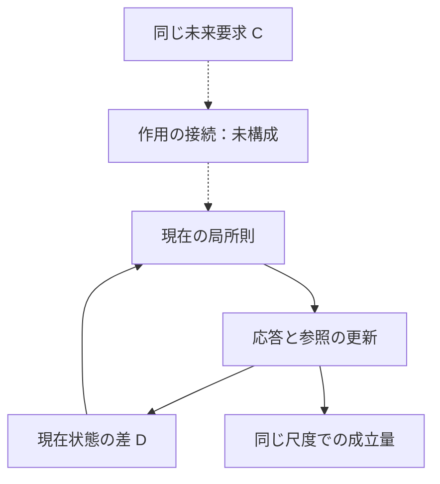

# 最小共通モデル候補：現在の接点 v0.1

2026-09-29。チャットで共有されたSolの骨格案と、アキの未来因果に関する10項目を受けたAstra案。独立盲検の新稿ではない。

**現在の差と要求の作用が接する局所則を構成した。未来から要求が作用する接続は未構成。最小共通モデルの完成・最小性・四理論の同一性は主張しない。**

- [意味・局所則・成立範囲](model.md)
- [標準ライブラリだけで再実行できる検算](checks/verify.py)
- [検算結果](checks/results.json)

旧Phase 2の六状態模型は固定版として残す。今回の局所則は連続時間の別候補であり、六状態模型の追加定理ではない。

## 一枚で読む

実線は候補式で構成した依存、点線は未構成の接続。図の循環や線の連続性自体を、未来因果や同じ差の証明にしない。

## 次の一件

要求の接続を一案だけ具体化し、未来列挙・経路指定を使っていないか、現在の目標誤差だけを使う比較例とどこが異なるかを示す。その接続を外したときの振る舞いも比較する。参照帰還の関係は別途指定が必要。
